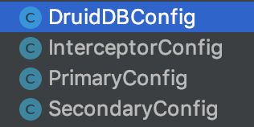
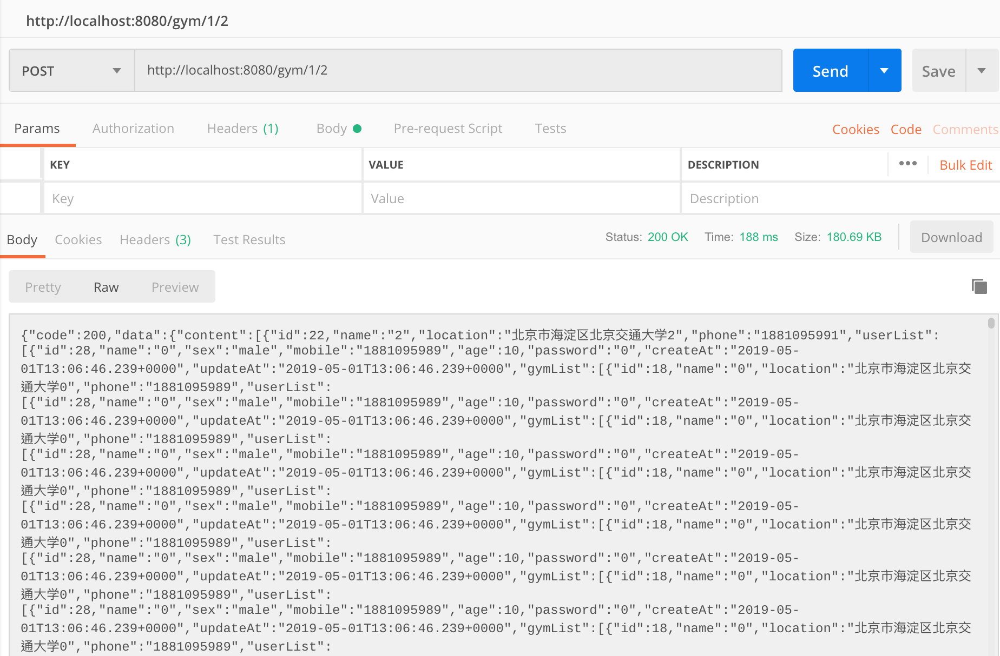

# GymSpringboot
使用springboot实现gym

# 组员

+ 刘如日 16301157  
+ 龙灏天 16301158  

# 项目说明
1. jpa_demo是springboot工程文件的根目录  
3. JDBC连接Mysql的用户名为root，密码为123456，详情请见yaml配置文件
4. 运行环境是Java8，IDE使用Intellij，需要在Intellij里面下载lombok插件
5. 启动的时候会自动在Mysql数据库生成表，两个数据源的名称分别为spring_study与spring_study2，因为在yaml配置里面写了jpa.properties.hibernate.hbm2ddl.auto=update
6. 在用户登录成功的时候会自动向数据库插入测试数据

<!-- TOC -->
# 第一次作业说明
  - [1.基础要求](#1基础要求)
      - [1.1 数据库设计](#11数据库设计)
      - [1.2 UML设计类图](#12UML设计类图)
      - [1.3 系统功能](#13系统功能)
  - [2.JPA 细化要求](#2JPA细化要求)
      - [2.1 多表联查](#21多表联查)
      - [2.2 多数据库源DruiDB](#22多数据库源DruiDB)
      - [2.3 分页查询](#23分页查询)
      - [2.4 审计](#24审计)
  - [3.Cache 细化要求](#3Cache细化要求)
      - [3.1实现缓存加速功能](#31实现缓存加速功能)
  - [4.Thymeleaf构建页面](#4Thymeleaf构建页面)
  - [5.集成Swagger文档](#5集成Swagger文档)
<!-- /TOC -->  

## 1基础要求

### 1.1数据库设计

总共有三个实体分别为Gym User Trainer

+Gym和User的关系为manyToMany
+Gym和Trainer的关系为OneToMany
+Trainer和Gym的关系为ManyToOne

数据库表结构为
+ USER(**ID**,AGE,CREATE_AT,MOBILE,NAME,PASSWORD,SEX,SEX,UPDATE_AT)
+ GYM（**ID**,LOCATION,CREATE_AT,NAME,UPDATE_AT,PHONE）
+ USER_GYM(**USER_ID**,**GYM_ID**)
+ TRAINER（**ID**,AGE,CREATE_AT,HEADPIC,INTRODUCTION,NAME,PHONE,UPDATE_AT,GYM_ID）

### 1.2UML设计类图

**Controller设计**
controller只负责View层的操作，负责处理Http的Request与Response  
  
 
**Service设计**
所有的业务逻辑都写在Service(接口，ServiceImp（实现）)层里面  
  

**Repository设计**
继承Jpa的Repo，根据需求重写一些方法
  

### 1.3系统功能

+ 登陆
    -
      
    
    点击网址可以进入登陆页面，有两个输入框，分别输入账号(注册完账户后会自动跳转到登录界面并分配用户id)，输入密码即可以登陆。
    
+ 注册
    -
      
    
    在密码输入框下方有一个“注册”小字，用户点击即可以弹出注册的悬浮框，用户填写相关信息后即可以成功注册，注册完账户后会自动跳转到登录界面并分配用户id。
+ 查看体育馆信息
    -
      
    
    点击登陆按钮后就会跳转到主页，显示用户在注册的时候所填写的信息，右侧有个课程列表是用户所订阅的课程的简要信息。  
    
## 2.JPA细化要求

### 2.1多表联查

+ 多表联查主要体现在Gym实体与其他实体之间  

+ gym实体实现 trainer与gym为 ManyToOne  

  

  

+ user实体实现 gym与user为 ManyToMany  

  

  

### 2.2多数据库源DruiDB

使用两个基于MySQL的数据库源 application.yaml配置如下

    spring:
      datasource:
        primary:
          url: jdbc:mysql://localhost:3306/spring_study?useSSL=false
          username: root
          password: 123456
          driver-class-name: com.mysql.jdbc.Driver

        secondary:
          url: jdbc:mysql://localhost:3306/spring_study2?useSSL=false
          username: root
          password: 123456
          driver-class-name: com.mysql.jdbc.Driver
        platform: mysql

并且在配置文件中配置相应启动项  

### 2.3分页查询

api设计时候加入pageSize和pageNum选项

    @PostMapping("/gym/{pageSize}/{pageNum}")
    public JSONObject findAll(@PathVariable Integer pageSize,@PathVariable Integer pageNum){
            System.out.println("pageSize: " + pageSize);
            System.out.println("pageNum: " + pageNum);
            Sort sort = new Sort(Sort.Direction.DESC, "id");
            Pageable pageable = new PageRequest(pageNum, pageSize, sort);
            return gymService.findAll(pageable);

使用Postman测试的结果如下  

  

### 2.4审计

+ 使用了JPA的审计功能，通过注解，此功能可以自动记录数据库每条记录创建和修改的时间戳。

## 3.Cache细化要求

### 3.1实现缓存加速功能
    
+ 查看体育馆详情
    在函数前添加注解
    
        @GetMapping("/gym/all")
        @Cacheable(key = "targetClass + methodName")
        public JSONObject getAllGym(){
            JSONObject res=new JSONObject();
            res.put("data",gymService.getallGym());
            return res;
        }

## 4.使用thymeleaf构建页面
## 5.集成Swagger文档
使用swagger生成restful接口界面，默认的api界面地址在http://localhost:8080/swagger-ui.html#/  
