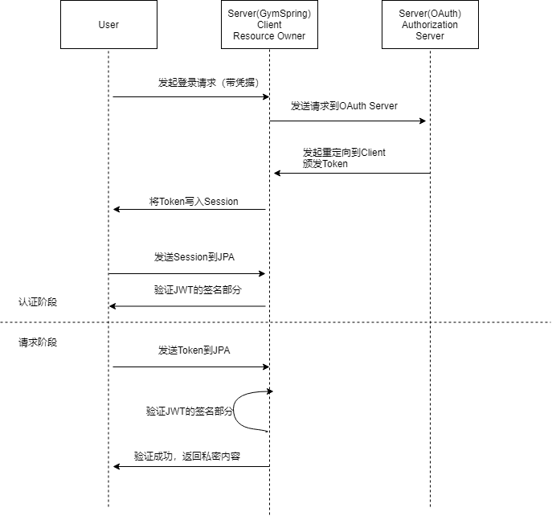
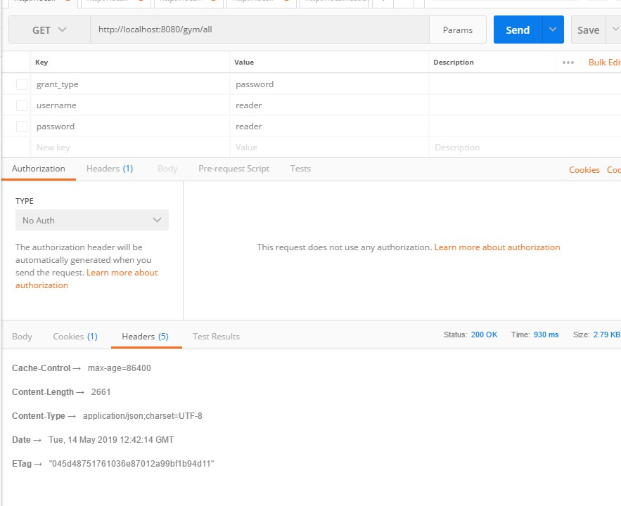

# Homework 第二阶段作业

## 1. OAuth 微服务部分

在`/oauth/`下是提供 OAuth 的微服务模块，提供 Authorization Server 的服务。

本系统使用 JWT 进行验证用户凭证的有效性。也就是说，其他模块只验证 JWT 的部分，而 Authorization Server 负责发行 Token。

一个完整的请求如下：



## 2. 缓存部分

在原有的强制缓存前提下，本阶段新增加了协商缓存的机制。

使用了`ShallowEtagHeaderFilter`对每个`RESTFul`请求进行了 ETag 的缓存。在使用相同的 ETag 请求时（`If-None-Match`）请求头，会返回如下结果：

```text
HTTP/1.1 304 Not Modified
ETag: "f88dd058fe004909615a64f01be66a7"
```

示例 ETag 返回如下：


## 3. 频率限制部分

对 OAuth 的登录部分新增了登录失败的次数限制，以及频率限制。

这部分使用了`Guava`的`LoadingCache`来进行高效的登记。

这部分使用了 Spring Security 的内置 IP 获取功能。

```java
@Bean public RequestContextListener requestContextListener(){
    return new RequestContextListener();
}
@Component
public class CustomAuthenticationFailureHandler extends SimpleUrlAuthenticationFailureHandler {

    @Autowired
    private MessageSource messages;

    @Override
    public void onAuthenticationFailure(/*...*/) {
        //...
        String errorMessage = messages.getMessage("message.badCredentials", null, locale);
        if (exception.getMessage().equalsIgnoreCase("blocked")) {
            errorMessage = messages.getMessage("auth.message.blocked", null, locale);
        }
        //...
    }
}
```
