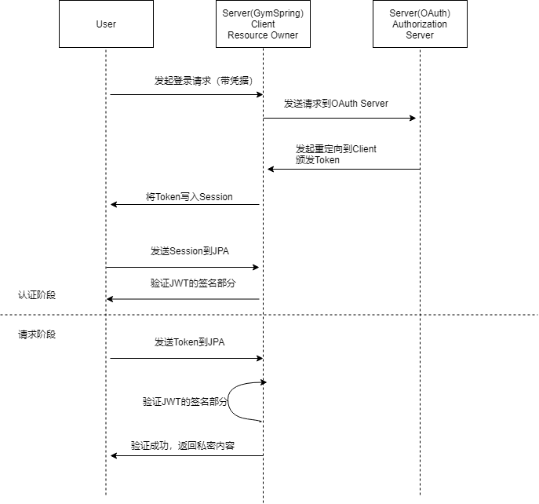

# 第二次作业说明

-   [1.基础要求](#1基础要求)
    -   [1.1 数据库设计](#11数据库设计)
    -   [1.2 UML 设计类图](#12UML设计类图)
    -   [1.3 系统功能](#13系统功能)
-   [2.API 细化要求](#2API细化要求)
    -   [2.1 API版本](#21API版本)
    -   [2.2 API分页](#22API分页)
    -   [2.3 Swagger在线API生成](#23Swagger在线API生成)
-   [3.Cache 细化要求](#3Cache细化要求)
    -   [3.1 实现缓存加速功能](#31实现缓存加速功能)
    -   [3.2 浏览器协商缓存功能](#32浏览器协商缓存功能)
    -   [3.3 Etag实现](#33Etag实现)
-   [4.限流](#4限流)
-   [5.Oauth微服务部分](#5Oauth微服务部分)
-   [6.Hateos实现]（#6Hateos实现）
      <!-- /TOC -->
      
## 1基础要求

### 1.1数据库设计


总共有三个实体分别为 Gym User Trainer

-   Gym 和 User 的关系为 manyToMany
-   Gym 和 Trainer 的关系为 OneToMany
-   Trainer 和 Gym 的关系为 ManyToOne

数据库表结构为

-   USER(**ID**,AGE,CREATE_AT,MOBILE,NAME,PASSWORD,SEX,SEX,UPDATE_AT)
-   GYM（**ID**,LOCATION,CREATE_AT,NAME,UPDATE_AT,PHONE）
-   USER_GYM(**USER_ID**,**GYM_ID**)
-   TRAINER（**ID**,AGE,CREATE_AT,HEADPIC,INTRODUCTION,NAME,PHONE,UPDATE_AT,GYM_ID）

### 1.2UML设计类图

**Controller 设计**
controller 只负责 View 层的操作，负责处理 Http 的 Request 与 Response  
 . 

**Service 设计**
所有的业务逻辑都写在 Service(接口，ServiceImp（实现）)层里面  
 . 

**Repository 设计**
继承 Jpa 的 Repo，根据需求重写一些方法
 . 

### 1.3系统功能

-   登陆 -
     .   
    点击网址可以进入登陆页面，有两个输入框，分别输入账号(注册完账户后会自动跳转到登录界面并分配用户 id)，输入密码即可以登陆。  
-   注册 -
     .   
    在密码输入框下方有一个“注册”小字，用户点击即可以弹出注册的悬浮框，用户填写相关信息后即可以成功注册，注册完账户后会自动跳转到登录界面并分配用户 id。  
-   查看体育馆信息 -
     .   
    点击登陆按钮后就会跳转到主页，显示用户在注册的时候所填写的信息，右侧有个课程列表是用户所订阅的课程的简要信息。  


## 2API细化要求  

### 2.1 API版本

api在设计的时候加入了版本的考虑


### 2.2 API分页

api 设计时候加入 pageSize 和 pageNum 选项

    @PostMapping("/gym/{pageSize}/{pageNum}")
    public JSONObject findAll(@PathVariable Integer pageSize,@PathVariable Integer pageNum){
            System.out.println("pageSize: " + pageSize);
            System.out.println("pageNum: " + pageNum);
            Sort sort = new Sort(Sort.Direction.DESC, "id");
            Pageable pageable = new PageRequest(pageNum, pageSize, sort);
            return gymService.findAll(pageable);

使用 Postman 测试的结果如下


###  2.3 Swagger在线API生成  

+ 对Swagger2进行类的配置和修改


+ 使用Swagger注解对Controller来生成Api


+ 生成的Controller的在线API文档

    
    
## 3Cache 细化要求

### 3.1 实现缓存加速功能

-   查看体育馆详情
    在函数前添加注解

```java
    @GetMapping("/gym/all")
    @Cacheable(key = "targetClass + methodName")
    public JSONObject getAllGym(){
    JSONObject res=new JSONObject();
    res.put("data",gymService.getallGym());
    return res;
    }
```

### 3.2 浏览器协商缓存功能

-   查看体育馆列表

通过修改返回的结果值为`ResponseEntity<>`类，可以对 RESTFul 的接口的返回形式进行细粒度的调整。

在返回的时候，使用如下方式开启强制缓存：

```java
JSONObject res = new JSONObject();
res.put("data", gymService.getallGym());
// 额外增加CacheControl头部，开启强缓存
return ResponseEntity.ok().cacheControl(CacheControl.maxAge(86400, TimeUnit.SECONDS)).body(res);
```

完成设置后，浏览器将缓存该数据一天。

在浏览器请求的时候，服务器返回的 Header 中将带有以下头域：

```text

Cache-Control: max-age=86400

```

### 3.3 Etag实现  

在原有的强制缓存前提下，本阶段新增加了协商缓存的机制。

使用了`ShallowEtagHeaderFilter`对每个`RESTFul`请求进行了 ETag 的缓存。在使用相同的 ETag 请求时（`If-None-Match`）请求头，会返回如下结果：

```text
HTTP/1.1 304 Not Modified
ETag: "f88dd058fe004909615a64f01be66a7"
```

示例 ETag 返回如下：


## 4.限流

对 OAuth 的登录部分新增了登录失败的次数限制，以及频率限制。

这部分使用了`Guava`的`LoadingCache`来进行高效的登记。

这部分使用了 Spring Security 的内置 IP 获取功能。

```java
@Bean public RequestContextListener requestContextListener(){
    return new RequestContextListener();
}
@Component
public class CustomAuthenticationFailureHandler extends SimpleUrlAuthenticationFailureHandler {

    @Autowired
    private MessageSource messages;

    @Override
    public void onAuthenticationFailure(/*...*/) {
        //...
        String errorMessage = messages.getMessage("message.badCredentials", null, locale);
        if (exception.getMessage().equalsIgnoreCase("blocked")) {
            errorMessage = messages.getMessage("auth.message.blocked", null, locale);
        }
        //...
    }
}
```

## 5.Oauth微服务部分

在`/oauth/`下是提供 OAuth 的微服务模块，提供 Authorization Server 的服务。

本系统使用 JWT 进行验证用户凭证的有效性。也就是说，其他模块只验证 JWT 的部分，而 Authorization Server 负责发行 Token。

一个完整的请求如下：




## 6.Hateos实现

当用户访问固定路径`/` `/user` `/course` `/coach` `gym`时候返回连接：


返回json类图为：


