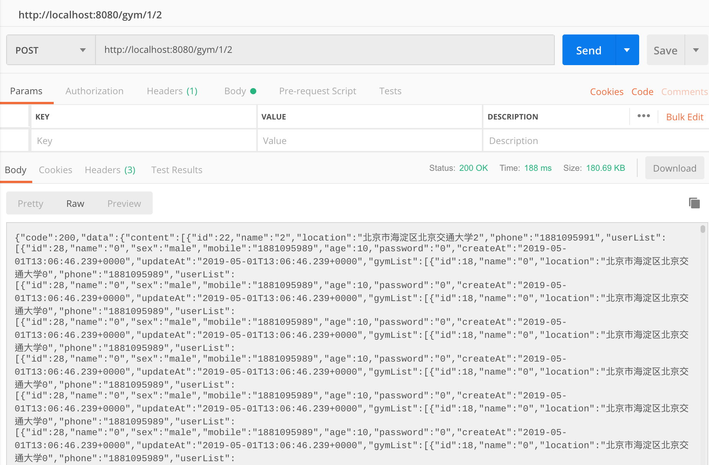

<!-- TOC -->

# 第三次作业说明

- [1.基础要求](#1基础要求)
  - [1.1 数据库设计](#11数据库设计)
  - [1.2 UML 设计类图](#12UML设计类图)
  - [1.3 系统功能](#13系统功能)
- [2.API 细化要求](#2API细化要求)
  - [2.1 API 版本](#21API版本)
  - [2.2 API 分页](#22API分页)
  - [2.3 Swagger 在线 API 生成](#23Swagger在线API生成)
- [3.Cache 细化要求](#3Cache细化要求)
  - [3.1 实现缓存加速功能](#31实现缓存加速功能)
  - [3.2 浏览器协商缓存功能](#32浏览器协商缓存功能)
  - [3.3 Etag 实现](#33Etag实现)
- [4.Kafka 服务器](#4Kafka服务器)

<!-- /TOC -->

## 1 基础要求

### 1.1 数据库设计


总共有三个实体分别为 Gym User Trainer

- Gym 和 User 的关系为 manyToMany
- Gym 和 Trainer 的关系为 OneToMany
- Trainer 和 Gym 的关系为 ManyToOne

数据库表结构为

- USER(**ID**,AGE,CREATE_AT,MOBILE,NAME,PASSWORD,SEX,SEX,UPDATE_AT)
- GYM（**ID**,LOCATION,CREATE_AT,NAME,UPDATE_AT,PHONE）
- USER_GYM(**USER_ID**,**GYM_ID**)
- TRAINER（**ID**,AGE,CREATE_AT,HEADPIC,INTRODUCTION,NAME,PHONE,UPDATE_AT,GYM_ID）

### 1.2UML 设计类图

**Controller 设计**
controller 只负责 View 层的操作，负责处理 Http 的 Request 与 Response  
 .

**Service 设计**
所有的业务逻辑都写在 Service(接口，ServiceImp（实现）)层里面  
 .

**Repository 设计**
继承 Jpa 的 Repo，根据需求重写一些方法
 .

### 1.3 系统功能

- 登陆 -
   .  
  点击网址可以进入登陆页面，有两个输入框，分别输入账号(注册完账户后会自动跳转到登录界面并分配用户 id)，输入密码即可以登陆。
- 注册 -
   .  
  在密码输入框下方有一个“注册”小字，用户点击即可以弹出注册的悬浮框，用户填写相关信息后即可以成功注册，注册完账户后会自动跳转到登录界面并分配用户 id。
- 查看体育馆信息 -
   .  
  点击登陆按钮后就会跳转到主页，显示用户在注册的时候所填写的信息，右侧有个课程列表是用户所订阅的课程的简要信息。

## 2API 细化要求

### 2.1API 版本

api 在设计的时候加入了版本的考虑


### 2.2API 分页

api 设计时候加入 pageSize 和 pageNum 选项

    @PostMapping("/gym/{pageSize}/{pageNum}")
    public JSONObject findAll(@PathVariable Integer pageSize,@PathVariable Integer pageNum){
            System.out.println("pageSize: " + pageSize);
            System.out.println("pageNum: " + pageNum);
            Sort sort = new Sort(Sort.Direction.DESC, "id");
            Pageable pageable = new PageRequest(pageNum, pageSize, sort);
            return gymService.findAll(pageable);

使用 Postman 测试的结果如下



### 2.3Swagger 在线 API 生成

- 对 Swagger2 进行类的配置和修改
  

- 使用 Swagger 注解对 Controller 来生成 Api
  

- 生成的 Controller 的在线 API 文档
  

## 3Cache 细化要求

### 3.1 实现缓存加速功能

- 查看体育馆详情
  在函数前添加注解

```java
    @GetMapping("/gym/all")
    @Cacheable(key = "targetClass + methodName")
    public JSONObject getAllGym(){
    JSONObject res=new JSONObject();
    res.put("data",gymService.getallGym());
    return res;
    }
```

### 3.2 浏览器协商缓存功能

- 查看体育馆列表

通过修改返回的结果值为`ResponseEntity<>`类，可以对 RESTFul 的接口的返回形式进行细粒度的调整。

在返回的时候，使用如下方式开启强制缓存：

```java
JSONObject res = new JSONObject();
res.put("data", gymService.getallGym());
// 额外增加CacheControl头部，开启强缓存
return ResponseEntity.ok().cacheControl(CacheControl.maxAge(86400, TimeUnit.SECONDS)).body(res);
```

完成设置后，浏览器将缓存该数据一天。

在浏览器请求的时候，服务器返回的 Header 中将带有以下头域：

```text

Cache-Control: max-age=86400

```

### 3.3Etag 实现

在原有的强制缓存前提下，本阶段新增加了协商缓存的机制。

使用了`ShallowEtagHeaderFilter`对每个`RESTFul`请求进行了 ETag 的缓存。在使用相同的 ETag 请求时（`If-None-Match`）请求头，会返回如下结果：

```text
HTTP/1.1 304 Not Modified
ETag: "f88dd058fe004909615a64f01be66a7"
```

示例 ETag 返回如下：


## 4.Kafka 服务器

使用 ZooKeeper 管理 Kafka 服务器。


启动 Kafka


创建 Kafka Producer 以及 Consumer

```java
package com.bjtu.kafka.services;

import org.slf4j.Logger;
import org.slf4j.LoggerFactory;
import org.springframework.kafka.annotation.KafkaListener;
import org.springframework.stereotype.Service;

@Service
public class Consumer {
  private final Logger logger = LoggerFactory.getLogger(Consumer.class);

  @KafkaListener(topics = "users", groupId = "group_id")
  public void consume(String message) {
    logger.info(String.format("$$ -> Consumed Message -> %s", message));
  }
}
```

```java
package com.bjtu.kafka.services;

import org.slf4j.Logger;
import org.slf4j.LoggerFactory;
import org.springframework.beans.factory.annotation.Autowired;
import org.springframework.kafka.core.KafkaTemplate;
import org.springframework.stereotype.Service;

@Service
public class Producer {
  private static final Logger logger = LoggerFactory.getLogger(Producer.class);
  private static final String TOPIC = "users";
  @Autowired
  private KafkaTemplate<String, String> kafkaTemplate;

  public void sendMessage(String message) {
    logger.info(String.format("$$ -> Producing message --> %s", message));
    this.kafkaTemplate.send(TOPIC, message);
  }
}
```

在创建完成以后，发送 RESTFul 请求到 Consumer Controller


在控制台上看到预期结果。


